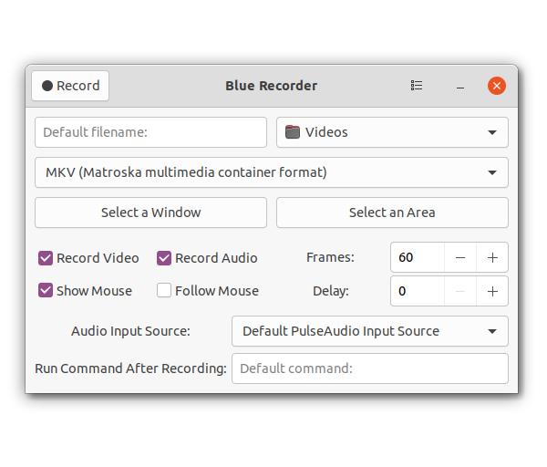

# Blue Recorder


A simple desktop recorder for Linux systems. Built using GTK+ 3 and ffmpeg. 

- It supports recording audio and video on almost all Linux interfaces with support for Wayland display server on GNOME session.
- The following formats are currently supported: mkv, avi, mp4, wmv, gif and nut.
- You can stop the recording process easily by right-clicking the icon and choosing "Stop Record". Or middle-clicking the recording icon in the notifications area (but doesn't work on all interfaces).
- You can choose the audio input source you want from the list.
- You can also set the default values you want by simply changing them in the interface, and the program will save them for you for the next time you open it. 

it based on [Green Recorder](https://github.com/mhsabbagh/green-recorder) and rewritten in Rust with improvements

## Installation
Blue Recorder available as Snap package


[](https://snapcraft.io/blue-recorder)

## Build from source
Blue Recorder depend in the following dependencies 
```
ffmpeg
gtk
gdk
gio
gettext
libappindicator3
x11-utils
pulseaudio
```

install dependencies Ubuntu and Debian based distros
```
sudo apt install build-essential clang cargo libappindicator3-1 x11-utils gettext pulseaudio ffmpeg
```
the use `Cargo` to build it
```
git clone https://github.com/xlmnxp/blue-recorder
cd <Project Directory>
cargo build --release
cp -a data interfaces po target/release
```
then you will find the executable file at 
`<Project Directory>/target/release/blue-recorder`

## License
```
GNU General Public License version 3
License Copyright: Copyright © 2007 Free Software Foundation, Inc.
License License: "Everyone is permitted to copy and distribute verbatim copies of this license document, but changing it is not allowed." (www.gnu.org/licenses/gpl-3.0.en.html).
License Contact: Free Software Foundation (fsf.org).
SPDX short identifier: GPL-3.0-only
Further resources...
```
[read the license](LICENSE.md)